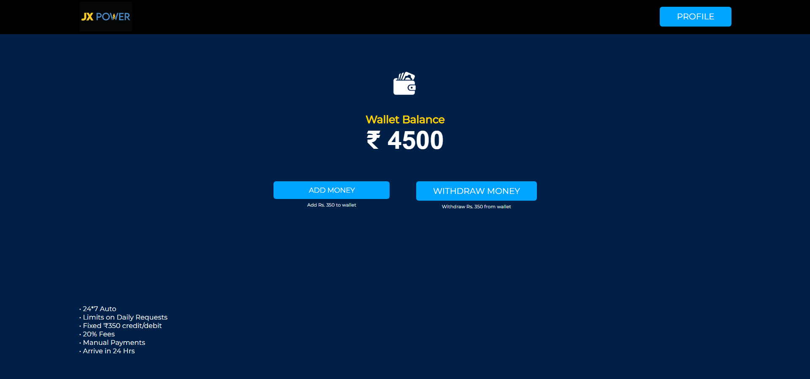

# Overview

**JX Power** is an intuitive and secure investment platform where users can grow their wealth by investing in structured financial plans.  
Built to deliver a smooth and reliable experience, JX Power empowers individuals to manage investments effortlessly, while providing transparent tracking and insights.


# Tools and technologies used


- **Backend** : Node.js, Express.js, MongoDB, EJS
- **Frontend** : HTML, CSS, JavaScript (Vanilla)
- **Architecture** : MVC
- **External APIS** : Stripe API
- **Version Control** : Git & GitHub

### Key NPM Packages Used

<div>
  
  
  
  
  
  
  
  
  
  
</div>

- **express** — Web framework for building APIs
- **dotenv** — Load environment variables from `.env` files
- **body-parser** — Parse incoming request bodies
- **cookie-parser** — Parse and manage cookies in requests
- **ejs** — Embedded JavaScript templating engine
- **mongoose** — MongoDB object modeling for Node.js
- **bcrypt** — Secure password hashing
- **jsonwebtoken** — Generate and verify JSON web tokens
- **nodemailer** — Send emails from your server
- **stripe** — Integrate Stripe payment gateway
- **multer** — Handle file uploads in Node.js
- **node-schedule** — Job scheduler for Node.js
- **nodemon** — Automatically restart the server on file changes


## 🚀 Features  

### 🔐 User Authentication  

<div>
    
    
    
    
</div>

- ✅ Email-based account registration and authentication  
- 🔒 Secure login system with password hashing  
- 🔄 Forgot password and reset password functionalities  

### 💰 Investment System  
<div style="display: flex; width: 100%; gap: 10px;">
<div style="width: 33%; height: 400px; display: flex; justify-content: center; align-items: center;">
    
  </div>
  
  <!-- First Column (100% height) -->
  <div style="width: 33%; height: 400px; display: flex; justify-content: center; align-items: center;">
    
  </div>

  <!-- Second Column (50% + 50% height) -->
  <div style="width: 33%; display: flex; flex-direction: column; gap: 10px;">
    <div style="height: 50%; display: flex; justify-content: center; align-items: center;">
      
    </div>
    <div style="height: 50%; display: flex; justify-content: center; align-items: center;">
      
    </div>
  </div>

  <!-- Third Column (100% height) -->
  

</div>


- 💵 Users can purchase JX coins using real money  
- 📈 Invest in customized plans based on preferences  
- 🏦 Automated interest calculation and payout system  

### 🛠️ Admin Panel  
<div>

  
  
</div>

- 👥 View all registered users and investment details  
- 📊 Monitor active investment plans and transactions  
- 🔑 Admin authentication with forgot/reset password functionality  

📸 **For more pictures, visit the** [`/Preview`](./Preview) **folder!** 🔍✨  


## Installation

### Prerequisites

- **Node.js** (v16 or higher) 
- **npm**  
- **MongoDB**
- **Git**  
- **Stripe Developer Account**
- **Postman** (API testing)
- **Visual Studio Code** (recommended IDE)
- **Modern web browser** (Chrome or Firefox recommended)


### Steps to Set Up Locally

1. Clone the repository
```bash
> git clone <repository-url>
> cd jx-power
```

2. Install backend dependencies
```bash
> npm install
```
3. Configure environment variables
```bash
> git clone <repository-url>
> cd jx-power
```

4. Start the server
```bash
> npm start
```

## 📩 Contact  
For any questions, feedback, or collaboration opportunities, feel free to reach out:  

- 📧 **Email:** [lukeshpatil05@gmail.com]  
- 🐙 **GitHub Issues:** [Open an Issue](https://github.com/your-repo/issues)  
- 💼 **LinkedIn:** [View My LinkedIn](https://www.linkedin.com/in/lukesh-patil/)  
- 📄 **Resume:** [View My Resume](https://your-resume-link.com)  

If you find this project interesting or have suggestions, I’d love to connect! 🚀